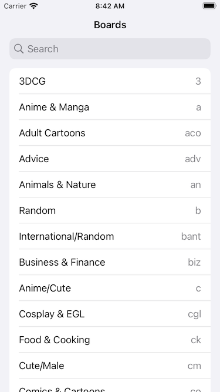
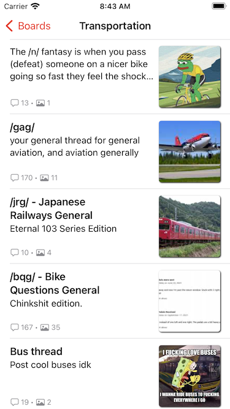
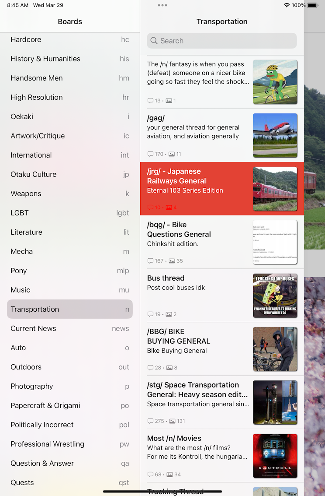

# HD

A High Definition 4Chan image board viewer.

## Screenshots

### iPhone

### iPad

## Features

+ View full-screen posts, images, animations, and videos.
+ Context menu allows
  + sharing/copying the post
  + browsing the post in Safari
+ iPad-optimized layout
+ Accessibility features like VoiceOver and Dynamic Type. 

## Known bugs / missing features

- No seeking controls for videos.
- No posting.
- No hiding of already seen threads.
- 4chan data is not cached.

## Requirements

+ iOS 16.0 / iPadOS 16.0
+ Xcode 14

## Installing

Apple does not allow 4chan.org apps on the App Store. Therefore you need to build and install HD yourself.

## Disclaimers

The [4chan](https://4chan.org/) image board tolerates more free speech than most people are
comfortable with. Some 4chan users are bigots, bullies, criminals, jerks, and/or trolls.
The author(s) of this application do not condone any of these users or their posts or acts.

The HD application is not associated with the [4chan](https://4chan.org/) image board web site.

## Open Source Packages

Name | Description
---- | -----------------------------
[FourChan api](https://github.com/jackpal/FourChanAPI) | 4Chan content API.
[HTMLString](https://github.com/jackpal/HTMLString) | Convert HTML content to AttributedString and/or String
[Introspect](https://github.com/siteline/SwiftUI-Introspect) | Access the UIKit views that implement SwiftUI views.
[Nuke](https://github.com/kean/Nuke) | Fast asynchronous image loader.
[SwiftSoup](https://github.com/scinfu/SwiftSoup) | HTML parser.
[SwiftyGIF](https://github.com/kirualex/SwiftyGif) | GIF image loader.
[vlckit-spm](https://github.com/tylerjonesio/vlckit-spm) | VLC webm player.

## Image credit

The app icon was created using [Draw Things](https://apps.apple.com/us/app/draw-things-ai-generation/id6444050820),
with the [ChilloutMix](https://civitai.com/models/6424/chilloutmix) model and
the [墨心 MoXin](https://civitai.com/models/12597/moxin) LORAs.

## License

This project is licensed under the terms of the MIT license.
